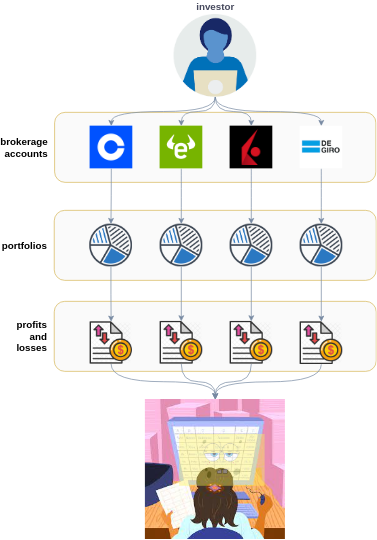
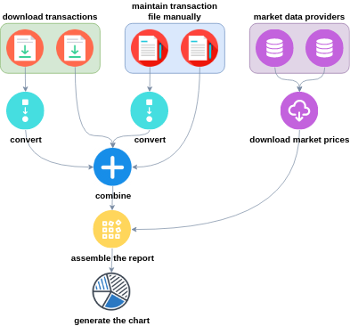
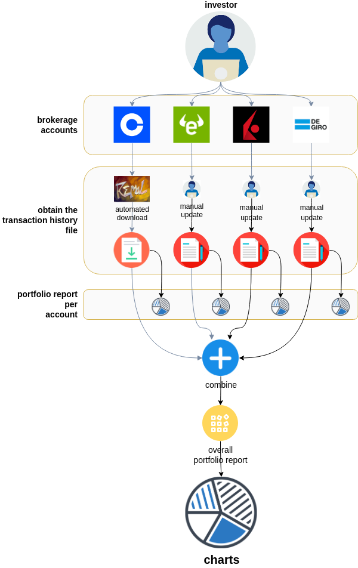
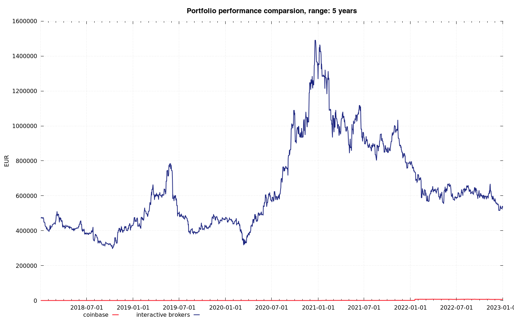

# Remal Portfolio Analyzer

> keywords: java, portfolio, stock market, gdax, interactive brokers, etoro, prise, report, currency, exchange rate

## Table of contents
* [1) Overview](#1-overview)
* [2) How the tool works](#2-how-the-tool-works)
* [3) How to execute the tool](#3-how-to-execute-the-tool)
  * [3.1) Downloading the trading-history data from a brokerage company](#31-downloading-the-trading-history-data-from-a-brokerage-company)
  * [3.2) Trading history file transformation](#32-trading-history-file-transformation)
  * [3.3) Combine multiple trading-history files into one](#33-combine-multiple-trading-history-files-into-one)
  * [3.4) Showing the trading history file](#34-showing-the-trading-history-file)
  * [3.5) Downloading the real time market price of a company](#35-downloading-the-real-time-market-price-of-a-company)
  * [3.6) Generating the portfolio summary report](#36-generating-the-portfolio-summary-report)
    * [3.6.1) Portfolio summary](#361-portfolio-summary)
    * [3.6.2) Portfolio report](#362-portfolio-report)
* [4) Generating your daily portfolio summary after the market closed](#4-generating-your-daily-portfolio-summary-after-the-market-closed)
* [5) Generating historical portfolio summaries](#5-generating-historical-portfolio-summaries)
* [6) Generating a portfolio-comparison and portfolio-report diagrams](#6-generating-a-portfolio-comparison-and-portfolio-report-diagrams)
* [7) Installation and system requirements](#7-installation-and-system-requirements)
* [8) Troubleshooting](#8-troubleshooting)
* [9) How to Contribute](#9-how-to-contribute)
* [Appendix 1) Supported transaction types](#appendix-1-supported-transaction-types)
* [Appendix 2) Fields in the transaction file](#appendix-2-fields-in-the-transaction-file)
* [Appendix 3) Fields in the portfolio summary report](#appendix-3-fields-in-the-portfolio-summary-report)
* [Appendix 4) Use in practice](#appendix-4-use-in-practice)
---

## 1) Overview
Investors diversificate investments and build portfolio while investing money on stock market.
Diversification is the practice of spreading your investments around so that your exposure to any one type of asset is limited.
This practice is designed to help reduce the volatility of your portfolio over time.

While you are building your portfolio usually you end up in a situation where you need to manage multiple brokerage accounts parallel.
For example, you use `Brokerage A` company to trade with cryptocurrencies, then you open another account with `Brokerage B` where you trade on the US market, and probably you will open other accounts for the European market.
If you have multiple accounts, then to keep up to date your own portfolio register and build an overall `portfolio summary` report is hard and requires hard manual administration.

<p align="center"></p>

The `Remal Portfolio Analyzer` helps you to track the performance of your separated portfolios in one place with as less effort as possible.
The tool downloads your daily trading transactions from the brokerage companies, merges them into a big ledger, and generates a portfolio summary report based on the live market price as often as you wish.
The report can be any kind of diagram or a [Markdown (text)][markdown] or an Excel file.

## 2) How the tool works
The `Remal Portfolio Analyzer` supports the following activities:
* [Downloading the `trading-history` directly from a brokerage company.](#31-downloading-the-trading-history-data-from-a-brokerage-company)
* [Trading history file transformation, i.e. converting timestamps between time zones, etc.](#32-trading-history-file-transformation)
* [Combine multiple `trading-history` files into one.](#33-combine-multiple-trading-history-files-into-one)
* [Showing the `trading history` files.](#34-showing-the-trading-history-file)
* [Downloading the real time market price based on the provided `ticker/symbol` from market data-provider.](#35-downloading-the-real-time-market-price-of-a-company)
* [Generating the portfolio summary report.](#36-generating-the-portfolio-summary-report)
* Showing the portfolio summary report on charts (column, line, pie, bar, etc.).
* Calculating a new portfolio summary report, especially the average price, based on a simulated buy/sell transaction that you are planning to execute. 

The following flow shows how a general workflow looks like:

<p align="center"></p>

## 3) How to execute the tool
The `Remal Portfolio Analyzer` is a command-line tool (`CLI`) that accepts text input from the user to execute the functions.
Today, the majority of applications have a graphical user interfaces (`GUI`), and most users never use command-line interfaces.
However, CLI is still used to configure computers, install software, and access features that are not available in the graphical interface.
The CLI applications provide us with many benefits that are unavailable, difficult to achieve, or incomplete with any GUI applications.
These benefits are numerous, but four in particular may come immediately to mind:
* Scalability
* Scriptability
* Simple design
* Repeatable executions

Considering the benefits of the CLI, this tool is just the right tool for the job.

The main operations that the `Remal Portfolio Analyzer` supports and the way of recall them is the following: `java -jar bin/portfolio-analyzer.jar`

Result:
```
Usage: java -jar portfolio-analyzer.jar [-hV] [coinbase | show | combine | price | portfolio]
Remal Portfolio Analyzer is a command-line tool that helps you to track your portfolio in one place and generate regular investment reports.

  -h, --help      Show this help message and exit.
  -V, --version   Print version information and exit.

Commands:
  coinbase   Download your personal transactions from Coinbase.
  show       Show transactions.
  combine    Combine transactions coming from different sources.
  price      Get the price of a stock.
  portfolio  Generates portfolio summary report.

Exit codes:
  0    Successful execution.
  1    An unexpected error appeared while executing this application.

Please report issues at arnold.somogyi@gmail.com.
Documentation, source code: https://github.com/zappee/portfolio-analyzer
```

### 3.1) Downloading the trading-history data from a brokerage company
The tool can download the daily trading transactions from the following brokerage companies:
* Coinbase: Crypto Currency marketplace

The command that activates the `coinbase` trading history download: `java -jar bin/portfolio-analyzer.jar coinbase`

Result:
```
Usage: java -jar portfolio-analyzer.jar coinbase [-s] (-k=<key> -p=<passphrase> -e=<secret> [-b=<baseCurrency>]
                                                 [-v=<inventoryValuation>] [-f=<from>] [-t=<to>]) [[-O=<outputFile>]
                                                 [-M=<writeMode>] [-R=<replaces>[,<replaces>...]]... [-E] [-A] [-L=<language>]
                                                 [-C=<columnsToHide>]... [-I=<decimalFormat>] [-D=<dateTimePattern>] [-Z=<zone>]
                                                 [-F=<from>] [-T=<to>]]

Download your personal transactions from Coinbase.

  -s, --silent              Perform actions without displaying any details.

Input (Coinbase PRO API)
  -k, --api-access-key      Coinbase PRO API key.
  -p, --api-passphrase      Coinbase PRO API passphrase.
  -e, --api-secret          Coinbase PRO API secret.
  -b, --base-currency       The currency of your Coinbase account you are allowed to trade, e.g. "EUR", etc. Default: "EUR"
  -v, --valuation           Default inventory valuation type. Candidates: FIFO, LIFO. Default: "FIFO"
  -f, --in-from             Filter on trade date, after a specified date. Pattern: "yyyy-MM-dd HH:mm:ss"
  -t, --in-to               Filter on trade date, before a specified date. Pattern: "yyyy-MM-dd HH:mm:ss"

Output:
  -O, --output-file         Write report to file (i.e. "'tmp/'yyyy-MM-dd'_report.md'"). Accepted extensions: .txt, .md and .csv
  -M, --file-mode           How to write the report to the file. Default: STOP_IF_EXIST Candidates: OVERWRITE, APPEND,
                              STOP_IF_EXIST
  -R, --replace             Replace the portfolio name. Format: "from:to, from:to", e.g. "default:coinbase".
  -E, --hide-report-title   Hide the report title.
  -A, --hide-table-header   Hide the table header in the report.
  -L, --language            Two-letter ISO-639-1 language code that controls the report language. Default: EN
  -C, --columns-to-hide     Comma separated list of column names that won't be displayed in the report. Candidates: PORTFOLIO,
                              SYMBOL, TYPE, VALUATION, TRADE_DATE, QUANTITY, PRICE, PRICE_CURRENCY, FEE, FEE_CURRENCY, ORDER_ID,
                              TRADE_ID, TRANSFER_ID
  -I, --decimal-format      Format numbers and decimals in the report. Default: "###,###,###,###,###,###.########"
  -D, --out-date-pattern    Pattern for formatting date and time in the report. Default: "yyyy-MM-dd HH:mm:ss"
  -Z, --out-timezone        The timezone of the dates, e.g. "GMT+2", "Europe/Budapest" Default: the system default time-zone
  -F, --out-from            Filter on trade date, after a specified date. Pattern: "yyyy-MM-dd HH:mm:ss"
  -T, --out-to              Filter on trade date, before a specified date. Pattern: "yyyy-MM-dd HH:mm:ss"
```

The following fields are mandatory and must be provided:

| parameter name         | description                 |
|------------------------|-----------------------------|
| `-k, --api-access-key` | Coinbase PRO API key        |
| `-p, --api-passphrase` | Coinbase PRO API passphrase |
| `-e, --api-secret`     | Coinbase PRO API secret     |

The article [How to create an API key][coinbase-api-key] describes the steps to obtain your personal API keys.

The command bellow downloads your personal transaction history from `Coinbase` and show the transactions on the screen:

   ```
   java -jar bin/portfolio-analyzer.jar coinbase \
      -k 94c...a1c \
      -p 9fx...xy7 \
      -e zuT...A==
   ```
_You must replace the API key values with your personal ones before the execution._

You will get a similar output:
```
|portfolio|symbol |type   |inventory valuation|trade date         |quantity      |price    |currency|fee           |fee currency|order id     |trade id|transfer id  |
|---------|-------|-------|-------------------|-------------------|--------------|---------|--------|--------------|------------|-------------|--------|-------------|
|Coinbase |EUR    |DEPOSIT|                   |2021-01-15 16:34:13|  500         |     1   |EUR     |              |EUR         |             |        |45dea8b3-f234|
|Coinbase |BTC-EUR|BUY    |                   |2021-02-11 07:34:19|    0.01      |36 933   |EUR     |0.73866       |EUR         |83bb62a9-c8a5|19094504|             |
|Coinbase |BTC-EUR|BUY    |                   |2021-02-11 07:34:19|    0.003     |36 933   |EUR     |0.221598      |EUR         |84345a9a-6ba5|34594533|             |
|Coinbase |EUR    |DEPOSIT|                   |2022-01-18 08:51:51|6 500         |     1   |EUR     |              |EUR         |             |        |60dea8b3-b796|
|Coinbase |BTC-EUR|BUY    |                   |2022-02-02 09:15:44|    0.00640035|34 065.92|EUR     |0.436067622144|EUR         |83b232a9-c8a5|190945f4|             |
|Coinbase |BTC-EUR|BUY    |                   |2022-02-02 09:15:49|    0.03359965|34 065.92|EUR     |2.289205977856|EUR         |b0cd4543-0842|19067657|             |
|Coinbase |BTC-EUR|SELL   |FIFO               |2022-04-12 13:57:33|    0.053     |37 178.52|EUR     |3.94092312    |EUR         |06e93b40-f824|11160462|             |
|Coinbase |ETH-EUR|BUY    |                   |2022-06-07 08:17:35|    1         | 1 645.07|EUR     |3.29014       |EUR         |ca200a35-e23d|11653001|             |
|Coinbase |BTC-EUR|BUY    |                   |2022-07-05 06:47:25|    0.025     |19 370.35|EUR     |0.9685175     |EUR         |61787b51-d425|11355386|             |
|Coinbase |ETH-EUR|BUY    |                   |2022-08-27 10:30:09|    0.68      | 1 515.51|EUR     |2.0610936     |EUR         |f8e65f80-30fc|14575489|             |
```

The following commands download and save your transaction history to a Markdown and a CSV file:

* Markdown (text) format:
   ```
  java \
     -jar bin/portfolio-analyzer.jar coinbase \
     -k 94...1c \
     -p 9f...y7 \
     -e zu...== \
     -b EUR \
     -O "'docs/coinbase-transactions_'yyyy-MM-dd'.md'" \
     -M OVERWRITE \
     -E \
     -R default:coinbase \
     -L EN \
     -D "yyyy-MM-dd HH:mm:ss" \
     -Z GMT
   ```
* Excel (CSV) format:
   ```
  java \
     -jar bin/portfolio-analyzer.jar coinbase \
     -k 94...1c \
     -p 9f...y7 \
     -e zu...== \
     -b EUR \
     -O "'docs/coinbase-transactions_'yyyy-MM-dd'.csv'" \
     -M OVERWRITE \
     -E \
     -R default:coinbase \
     -L EN \
     -D "yyyy-MM-dd HH:mm:ss" \
     -Z GMT
   ```

The `*.csv` file can be opened as an Excel file.
While opening the file use comma (`,`) for the CSV separator character.

For the best user experience, open the `*.md` file with a Markdown editor like [dillinger][dillinger]. The result you get is a wel formatted report:

|portfolio|symbol |type   |inventory valuation|trade date         |quantity      |price    |currency|fee           |fee currency|order id     |trade id|transfer id  |
|---------|-------|-------|-------------------|-------------------|--------------|---------|--------|--------------|------------|-------------|--------|-------------|
|Coinbase |EUR    |DEPOSIT|                   |2021-01-15 16:34:13|  500         |     1   |EUR     |              |EUR         |             |        |45dea8b3-f234|
|Coinbase |BTC-EUR|BUY    |                   |2021-02-11 07:34:19|    0.003     |36 933   |EUR     |0.221598      |EUR         |84345a9a-6ba5|34594533|             |
|Coinbase |EUR    |DEPOSIT|                   |2022-01-18 08:51:51|6 500         |     1   |EUR     |              |EUR         |             |        |60dea8b3-b796|
|Coinbase |BTC-EUR|BUY    |                   |2022-02-02 09:15:49|    0.03359965|34 065.92|EUR     |2.289205977856|EUR         |b0cd4543-0842|19067657|             |
|Coinbase |BTC-EUR|SELL   |FIFO               |2022-04-12 13:57:33|    0.053     |37 178.52|EUR     |3.94092312    |EUR         |06e93b40-f824|11160462|             |

### 3.2) Trading history file transformation
There is a possibility to convert the data in the transaction file.
You can
* rename the `portfolio name`
* convert the `trade date` between different timezones
* change date-time format of the `trade date`
* change the way how decimal numbers show in `quantity`, `price` and `fee` columns
* hide any columns
* filter the data by `trade-date`
* filter the data by `symbol`
* set the report language
* convert `*.md` formatted file to a `*.csv` content

Command that activates the `transform` command: `java -jar bin/portfolio-analyzer.jar show`

Result:
```
Usage: java -jar portfolio-analyzer.jar show [-s] ([-e] [-a] [-p=<portfolio>] [-c=<symbols>]... [-d=<dateTimePattern>]
                                             [-z=<zone>] [-f=<from>] [-t=<to>] [-m=<missingColumns>]... -i=<file>)
                                             [[-O=<outputFile>] [-M=<writeMode>] [-R=<replaces>[,<replaces>...]]... [-E] [-A]
                                             [-L=<language>] [-C=<columnsToHide>]... [-I=<decimalFormat>] [-D=<dateTimePattern>]
                                             [-Z=<zone>] [-F=<from>] [-T=<to>]]

Show transactions.

  -s, --silent              Perform actions without displaying any details.

Input:
  -i, --input-file          File with transactions. Accepted extensions: .txt, .md and .csv
  -e, --has-report-title    The report file contains title.
  -a, --has-table-header    The table has a header in the report.
  -p, --portfolio           Portfolio name filter.
  -c, --symbol              Product filter, that is a comma separated list with symbols, e.g. "BTC-EUR, AMZN".
  -d, --in-date-pattern     Pattern for parsing date and time. Default: "yyyy-MM-dd HH:mm:ss"
  -z, --in-timezone         The timezone of the dates, e.g. "GMT+2", "Europe/Budapest" Default: the system default time-zone
  -f, --in-from             Filter on trade date, after a specified date. Pattern: "yyyy-MM-dd HH:mm:ss"
  -t, --in-to               Filter on trade date, before a specified date. Pattern: "yyyy-MM-dd HH:mm:ss"
  -m, --missing-columns     Comma separated list to set the missing columns in the report. Use with the '-columns-to-hide'
                              option.

Output:
  -O, --output-file         Write report to file (i.e. "'tmp/'yyyy-MM-dd'_report.md'"). Accepted extensions: .txt, .md and .csv
  -M, --file-mode           How to write the report to the file. Default: STOP_IF_EXIST Candidates: OVERWRITE, APPEND,
                              STOP_IF_EXIST
  -R, --replace             Replace the portfolio name. Format: "from:to, from:to", e.g. "default:coinbase".
  -E, --hide-report-title   Hide the report title.
  -A, --hide-table-header   Hide the table header in the report.
  -L, --language            Two-letter ISO-639-1 language code that controls the report language. Default: EN
  -C, --columns-to-hide     Comma separated list of column names that won't be displayed in the report. Candidates: PORTFOLIO,
                              SYMBOL, TYPE, VALUATION, TRADE_DATE, QUANTITY, PRICE, PRICE_CURRENCY, FEE, FEE_CURRENCY, ORDER_ID,
                              TRADE_ID, TRANSFER_ID
  -I, --decimal-format      Format numbers and decimals in the report. Default: "###,###,###,###,###,###.########"
  -D, --out-date-pattern    Pattern for formatting date and time in the report. Default: "yyyy-MM-dd HH:mm:ss"
  -Z, --out-timezone        The timezone of the dates, e.g. "GMT+2", "Europe/Budapest" Default: the system default time-zone
  -F, --out-from            Filter on trade date, after a specified date. Pattern: "yyyy-MM-dd HH:mm:ss"
  -T, --out-to              Filter on trade date, before a specified date. Pattern: "yyyy-MM-dd HH:mm:ss"
```

### 3.3) Combine multiple trading-history files into one
As that was mentioned earlier, the `Remal Portfolio Analyzer` can download your transaction history from the brokerage companies.
The transaction history file contains information about the trades that you have executed earlier (i.e. buying price, selling price, deposit, withdrawals, fee, etc.).
That history file can be used to generate your portfolio report.
But if you have multiple brokerage accounts then you have multiple transaction history files, and if you would like to see your overall portfolio result then you need to have a transaction history file that contains all transaction data that you have executed.
The `combine` command helps you to merge your separated transaction history files into one.
Then you can generate the overall portfolio report based on this data.

This is how it works:

1. Use the `coinbase` function to download the transaction history from Coinbase
2. Maintain your transaction files manually that are contains your trade data coming from different brokerage companies
3. Optional: manipulate the transaction data if it is necessary
4. Optional: generate portfolio summary report per brokerage account
5. Combine the individual portfolio reports into one
6. Generate the overall portfolio summary report
7. Generate your charts based on the portfolio summary report (*.csv file) 

<p align="center"></p>

Command that activates the `combine` command: `java -jar bin/portfolio-analyzer.jar combine`

Result:
```
Usage: java -jar portfolio-analyzer.jar combine [-q] ([-e] [-a] [-p=<portfolio>] [-c=<symbols>]... [-d=<dateTimePattern>]
                                                [-z=<zone>] [-f=<from>] [-t=<to>] [-m=<missingColumns>]... [-i=<files>...]...
                                                [-o]) [[-O=<outputFile>] [-M=<writeMode>] [-R=<replaces>[,<replaces>...]]...
                                                [-E] [-A] [-L=<language>] [-C=<columnsToHide>]... [-I=<decimalFormat>]
                                                [-D=<dateTimePattern>] [-Z=<zone>] [-F=<from>] [-T=<to>]]

Combine transactions coming from different sources.

  -q, --quiet               In this mode log wont be shown.

Input:
  -i, --input-files         Comma separated list of files with transactions to be combined. Accepted extensions: .txt, .md and .
                              csv
  -o, --overwrite           Overwrite the same transactions while combining them.
  -e, --has-report-title    The report file contains title.
  -a, --has-table-header    The table has a header in the report.
  -p, --portfolio           Portfolio name filter.
  -c, --symbol              Product filter, that is a comma separated list with symbols, e.g. "BTC-EUR, AMZN".
  -d, --in-date-pattern     Pattern for parsing date and time. Default: "yyyy-MM-dd HH:mm:ss"
  -z, --in-timezone         The timezone of the dates, e.g. "GMT+2", "Europe/Budapest" Default: the system default time-zone
  -f, --in-from             Filter on trade date, after a specified date. Pattern: "yyyy-MM-dd HH:mm:ss"
  -t, --in-to               Filter on trade date, before a specified date. Pattern: "yyyy-MM-dd HH:mm:ss"
  -m, --missing-columns     Comma separated list to set the missing columns in the report. Use with the '-columns-to-hide'
                              option.

Output:
  -O, --output-file         Write report to file (i.e. "'tmp/'yyyy-MM-dd'_report.md'"). Accepted extensions: .txt, .md and .csv
  -M, --file-mode           How to write the report to the file. Default: STOP_IF_EXIST Candidates: OVERWRITE, APPEND,
                              STOP_IF_EXIST
  -R, --replace             Replace the portfolio name. Format: "from:to, from:to", e.g. "default:coinbase".
  -E, --hide-report-title   Hide the report title.
  -A, --hide-table-header   Hide the table header in the report.
  -L, --language            Two-letter ISO-639-1 language code that controls the report language. Default: EN
  -C, --columns-to-hide     Comma separated list of column names that won't be displayed in the report. Candidates: PORTFOLIO,
                              SYMBOL, TYPE, VALUATION, TRADE_DATE, QUANTITY, PRICE, PRICE_CURRENCY, FEE, FEE_CURRENCY, ORDER_ID,
                              TRADE_ID, TRANSFER_ID
  -I, --decimal-format      Format numbers and decimals in the report. Default: "###,###,###,###,###,###.########"
  -D, --out-date-pattern    Pattern for formatting date and time in the report. Default: "yyyy-MM-dd HH:mm:ss"
  -Z, --out-timezone        The timezone of the dates, e.g. "GMT+2", "Europe/Budapest" Default: the system default time-zone
  -F, --out-from            Filter on trade date, after a specified date. Pattern: "yyyy-MM-dd HH:mm:ss"
  -T, --out-to              Filter on trade date, before a specified date. Pattern: "yyyy-MM-dd HH:mm:ss"
```

Example command that combines three different transaction files into one:
```
java \
  -jar bin/portfolio-analyzer.jar combine \
  -i "'docs/coinbase-transactions_'yyyy-MM-dd'.md', 'docs/coinbase-corrections-shib.md', 'docs/ib-transactions_2018-12-24.md'" \
  -a \
  -o \
  -O "'docs/transactions_'yyyy-MM-dd'.md'" \
  -M OVERWRITE \
  -L EN \
  -Z GMT
 ```

During the combine the value of the `order id `, `trade id` and `transfer id` must be unique, otherwise the second transaction with the same identifier will be skipped. 

### 3.4) Showing the trading history file
The `show` command can be used to show the content of the transaction history file on the screen.
The same command can be also used to transform history file content as well.

The following simple command prints the transaction history data stored in a `csv` file on the screen:
  ```
  java \
     -jar bin/portfolio-analyzer.jar show \
     -i "'docs/coinbase-transactions_'yyyy-MM-dd'.csv'" \
     -a \
     -C "ORDER_ID, TRADE_ID, TRANSFER_ID"
   ```

Please check [paragraph 3.2](#32-trading-history-file-transformation) for more information. 

### 3.5) Downloading the real time market price of a company
The `Remal Portfolio Analyzer` is able to download real market prices of and known company.
In order to you can use this feature, you need to know the company's symbol/ticker name.
If you do not know the symbols you need, then search for them on the internet.

Popular symbols:
* `BTC-EUR`: Bitcoin price in euro
* `ETH-EUR`: Ethereum price in euro
* `AMZN`: Amazon
* `TSLA`: Tesla
* `USDEUR=X`: USD/EUR exchange rate

Command that you can use to download market price of a company: `java -jar bin/portfolio-analyzer.jar price`

Result:
  ```
Usage: java -jar portfolio-analyzer.jar price [-q] [-P=<priceHistoryFile>] (-i=<symbol> [-c=<tradeDate>] [-t=<dateTimePattern>]
                                              [-z=<zone>] (-d=<dataProvider> | -l=<dataProviderFile>)) [[-U=<multiplicity>]
                                              [-M=<writeMode>] [-L=<language>] [-I=<decimalFormat>] [-D=<dateTimePattern>]
                                              [-Z=<zone>]]

Get the price of a stock.

  -q, --quiet                In this mode log wont be shown.
  -P, --price-history        Storing the price in a file, e.g. "'price_'yyyy'.md'". Accepted extensions: .txt, .md and .csv

Input:
  -i, --symbol               The product id that represents the company's stock.
  -c, --date                 The price of a stock on a certain date in the past.
  -t, --date-pattern         Pattern for parsing the provided date. Default: "yyyy-MM-dd HH:mm:ss".
  -z, --in-timezone          The timezone of the dates, e.g. "GMT+2", "Europe/Budapest" Default: the system default time-zone
  -d, --data-provider        Retrieve the market price using the provider. Candidates: YAHOO, COINBASE_PRO, NOT_DEFINED.
  -l, --data-provider-file   Path to the data provider dictionary *.properties file that is used to downloadthe market prices.

Output:
  -U, --multiplicity         Controls the number of records in the output file. Candidates: ONE_MINUTE, FIVE_MINUTES,
                               FIFTEEN_MINUTES, THIRTY_MINUTES, ONE_HOUR, FOUR_HOURS, ONE_DAY, MANY. Default: ONE_HOUR.
  -M, --file-mode            How to write the history file to disk. Default: STOP_IF_EXIST Candidates: OVERWRITE, APPEND,
                               STOP_IF_EXIST
  -L, --language             Two-letter ISO-639-1 language code that controls the report language. Default: EN.
  -I, --decimal-format       Format numbers and decimals in the report. Default: "###,###,###,###,###,###.########"
  -D, --out-date-pattern     Pattern for formatting date and time in the report. Default: "yyyy-MM-dd HH:mm:ss"
  -Z, --out-timezone         The timezone of the dates, e.g. "GMT+2", "Europe/Budapest" Default: the system default time-zone
  ```

The following command will download the Amazon stock price from Yahoo:
```
java \
   -jar bin/portfolio-analyzer.jar price \
   -i AMZN \
   -d YAHOO \
   -c "2022-09-14 18:00:00"
 ```

Result:
```
|symbol|price     |trade date         |request date       |data provider|
|------|----------|-------------------|-------------------|-------------|
|AMZN  |128.550003|2022-09-14 00:00:00|2022-09-14 18:00:00|YAHOO        |
```

If you are interested in the real-time price then do not use the `date` filter.
If you wish, you can save the result to a Markdown or a CSV file as well.

For the better user experience you can define a `data-provider-dictionary` file and use it via the `--data-provider-file` parameter.
This dictionary file is also used by the tool when you generate the portfolio summary report.

The dictionary is a file with `key-value` pairs where the `key` is the `symbol` of the company and the `value` represents the `data-privider`:
* `AMZN=YAHOO`

In a complicated case, when the company's symbol that you use in your transaction history does not match with the symbol that is used by the data provider you must use the following value:
* `USD-EUR=YAHOO;USDEUR=X`

Sometimes the symbol that is used locally does not match with the company's international symbol name.
For example the symbol of `OTP Bank` that is used in the [Budapest Stock Exchange][bux] is `OTP`.
But Yahoo knows this company as `OTP.BD`.
In this case you must place a special definition in the dictionary file for this company, otherwise the portfolio summary generator may fail. 
* `OTP=YAHOO;OTP.BD`

The following example shows how a dictionary file may look like:
```
# cryptos
AVAX-EUR=COINBASE_PRO
BTC-EUR=COINBASE_PRO
DOGE-EUR=COINBASE_PRO
ETH-EUR=COINBASE_PRO
SHIB-EUR=COINBASE_PRO
SHIB=COINBASE_PRO;SHIB-EUR
SOL-EUR=COINBASE_PRO
XRP-EUR=YAHOO

# securities
AAPL=YAHOO
AMZN=YAHOO
BAC=YAHOO
GRVY=YAHOO
GS=YAHOO
IBM=YAHOO
MASTERPLAST=YAHOO;MAST.BD
MMM=YAHOO
MOL=YAHOO;MOL.BD
MSFT=YAHOO
MU=YAHOO
NFLX=YAHOO
OPUS=YAHOO;OPUS.BD
ORCL=YAHOO
OTP=YAHOO;OTP.BD
TSLA=YAHOO
UHAL=YAHOO
WDC=YAHOO
WNC=YAHOO
VNA.DE=YAHOO

# currencies
EUR-HUF=YAHOO;EURHUF=X
HUF-EUR=YAHOO;HUFEUR=X
USD-EUR=YAHOO;EUR=X
USD-HUF=YAHOO;HUF=X
```

You can download a ready for use dictionary file here: [docs/demo-portfolio/market-data-providers.properties](docs/demo-portfolio/market-data-providers.properties)

The following example shows you how to define the path to a dictionary file:
```
java \
   -jar bin/portfolio-analyzer.jar price \
   -i AMZN \
   -p "'docs/market-data-providers.properties'" \
   -c "2022-09-14 18:00:00"
 ```

If you wish to save the price that the tool downloaded to a `price-history` file, then you can control the number of prices within a period with the `multiplicity` parameter.
That way you can keep your price-history file as small as possible.
Otherwise, the history file can be huge quickly, especially if you call this command from a loop.

Another cool feature of the `price` command is that if you use a price-history file and the requested price exists in the history, then the tool will not connect to the internet to download the price.
Instead of it, the tool will take the price from the history file.

The benefit of using the price-history file is the followings:
* That way you can use the tool on a computer where you have no internet connection.
* During the portfolio summary report generation, it is possible that the tool tries to download the same price multiple time. After the first download, the price will be stored in the history file. Then the next time the tool take the price from the history file. This can degrees the portfolio report generation time dramatically.

The following command shows ho to use `data-provider-file` and `price-history` file together:  
```
java \
   -jar bin/portfolio-analyzer.jar price \
   -i AMZN \
   -p "'docs/market-data-providers.properties'" \
   -c "2022-09-14 18:00:00" \
   -P docs/price-history.md \
   -M APPEND \
   -U FIVE_MINUTES
 ```

If you get a `[ERROR] Price not found` error message, then you need to use a different date and time because the data-provider that you use has no price for this time.

### 3.6) Generating the portfolio summary report
Once you have the transaction file that contains all of your trades that you have executed, you can generate a `portfolio summary report` that shows you the performance of your portfolio.

Command that activates the `portfolio` report generator: `java -jar bin/portfolio-analyzer.jar portfolio`

Result:
```
Usage: java -jar portfolio-analyzer.jar portfolio [-q] [-P=<priceHistoryFile>] ([-e] [-a] [-p=<portfolio>] [-c=<symbols>]... [-d=<dateTimePattern>]
                                                  [-z=<zone>] [-f=<from>] [-t=<to>] [-m=<missingColumns>]... -i=<file> [-l=<dataProviderFile>])
                                                  [[-B=<baseCurrency>] [-O=<portfolioSummaryFile>] [-S=<portfolioReportFile>] [-M=<writeMode>]
                                                  [-U=<multiplicity>] [-J] [-R=<replaces>[,<replaces>...]]... [-E] [-A] [-L=<language>] [-I=<decimalFormat>]
                                                  [-D=<dateTimePattern>] [-Z=<zone>] [-C=<columnsToHide>]...]

Generates portfolio summary report.

  -q, --quiet                In this mode log wont be shown.
  -P, --price-history        Storing the price in a file, e.g. "'price_'yyyy'.md'". Accepted extensions: .txt, .md and .csv

Input:
  -i, --input-file           File with transactions. Accepted extensions: .txt, .md and .csv
  -l, --data-provider-file   Path to the data provider dictionary *.properties file that is used to downloadthe market prices.
  -e, --has-report-title     The report file contains title.
  -a, --has-table-header     The table has a header in the report.
  -p, --portfolio            Portfolio name filter. The "*" symbol can be use to select the all portfolios.
  -c, --symbol               Product filter, that is a comma separated list with symbols, e.g. "BTC-EUR, AMZN".
  -d, --in-date-pattern      Pattern for parsing date and time. Default: "yyyy-MM-dd HH:mm:ss"
  -z, --in-timezone          The timezone of the dates, e.g. "GMT+2", "Europe/Budapest" Default: the system default time-zone
  -f, --in-from              Filter on trade date, after a specified date. Pattern: "yyyy-MM-dd HH:mm:ss"
  -t, --in-to                Filter on trade date, before a specified date. Pattern: "yyyy-MM-dd HH:mm:ss"
  -m, --missing-columns      Comma separated list to set the missing columns in the report. Use with the '-columns-to-hide' option.

Output:
  -B, --base-currency        The currency of the portfolio report, e.g. "EUR", etc. Default: "EUR"
  -O, --portfolio-summary    Write the portfolio summary to a file (i.e. "'tmp/'yyyy-MM-dd'_portfolio-summary.md'"). Accepted extensions: .txt, .md and .csv
  -S, --portfolio-report     Write the portfolio report to a CSV file , i.e. "'tmp/'yyyy-MM-dd'_portfolio-report.csv'". Accepted extensions: .csv
  -M, --file-mode            How to write the report to the file. Default: STOP_IF_EXIST Candidates: OVERWRITE, APPEND, STOP_IF_EXIST
  -U, --multiplicity         Controls the number of records in the output file. Candidates: ONE_MINUTE, FIVE_MINUTES, FIFTEEN_MINUTES, THIRTY_MINUTES,
                               ONE_HOUR, FOUR_HOURS, ONE_DAY, MANY. Default: ONE_HOUR.
  -J, --show-transactions    Show the relevant transactions.
  -R, --replace              Replace the portfolio name. Format: "from:to, from:to", e.g. "default:coinbase".
  -E, --hide-report-title    Hide the report title.
  -A, --hide-table-header    Hide the table header in the report.
  -L, --language             Two-letter ISO-639-1 language code that controls the report language. Default: EN
  -I, --decimal-format       Format numbers and decimals in the report. Default: "###,###,###,###,###,###.########"
  -D, --out-date-pattern     Pattern for formatting date and time in the report. Default: "yyyy-MM-dd HH:mm:ss"
  -Z, --out-timezone         The timezone of the dates, e.g. "GMT+2", "Europe/Budapest" Default: the system default time-zone
  -C, --columns-to-hide      Comma separated list of column names that won't be displayed in the report. Candidates: PORTFOLIO, SYMBOL, QUANTITY, AVG_PRICE,
                               INVESTED_AMOUNT, MARKET_UNIT_PRICE, MARKET_VALUE, PROFIT_LOSS, PROFIT_LOSS_PERCENT, COSTS, DEPOSITS, WITHDRAWALS, TOTAL_CASH,
                               TOTAL_EXCHANGE_RATE, TOTAL_DEPOSIT, TOTAL_WITHDRAWAL, TOTAL_INVESTMENT, TOTAL_MARKET_VALUE, TOTAL_PROFIT_LOSS
```

#### 3.6.1) Portfolio summary
The `portfolio summary` is a report that shows you the current overall status of your portfolio in a Markdown or CSV file.

This command generates and saves the portfolio summary to a Markdown file based on your transaction history file and the realtime market data, that will be downloaded from the internet while generating the report:
```
java \
   -jar bin/portfolio-analyzer.jar portfolio \
   -i "'docs/transactions_2022-09-25.md'" \
   -e \
   -a \
   -l "'docs/market-data-providers.properties'" \
   -t "2022-09-28 23:59:59" \
   -B EUR \
   -P "'docs/price-history.md'" \
   -L EN \
   -M APPEND \
   -U ONE_HOUR \
   -O "'docs/portfolio-summary.md'"
```

This command generates a CSV portfolio report:

```
java \
   -jar bin/portfolio-analyzer.jar portfolio \
   -i "'docs/transactions/transactions_2022-09-25.md'" \
   -e \
   -a \
   -l "'docs/market-data-providers.properties'" \
   -t "2022-09-28 23:59:59" \
   -B EUR \
   -P "'docs/price-histories/price-history.md'" \
   -L EN \
   -C "PORTFOLIO, SYMBOL, PROFIT_LOSS, QUANTITY, AVG_PRICE, INVESTED_AMOUNT, MARKET_UNIT_PRICE, MARKET_VALUE, COST_TOTAL, DEPOSIT_TOTAL, WITHDRAWAL_TOTAL" \
   -M APPEND \
   -U ONE_HOUR \
   -O "'docs/sample-portfolio/reports/portfolio-summary/portfolio-summary.csv'"
```

This is how the portfolio summary looks like:

```
# Portfolio summary
_Generated: 2022-09-28 23:59:59_

|portfolio          |symbol  |quantity          |average price  |market price   |market value|investment|P/L       |P/L %   |costs|deposit total     |withdrawal total|
|-------------------|--------|------------------|---------------|---------------|------------|----------|----------|--------|-----|------------------|----------------|
|Coinbase           |BTC-EUR |        0.025     |19 370.35      |20 134.74      |      503.37|    484.26|     19.11|  103.95| 0.97|                  |                |
|Coinbase           |ETH-EUR |        1.68      | 1 592.62904762| 1 382.08      |    2 321.89|  2 675.62|   -353.73|   86.78| 5.35|                  |                |
|Coinbase           |EUR     |    3 950.88400418|     1         |     1         |    3 950.88|          |          |        | 3.94|    7 000         |                |
|Coinbase           |SHIB-EUR|3 209 462.73716165|     0.00006138|     0.00001149|       36.88|    197   |   -160.12|   18.72| 2.99|3 209 462.73716165|                |
|Interactive Brokers|BAC     |    1 722.8       |     5.8       |    30.75      |   52 976.1 |  9 992.24| 42 983.86|  530.17| 7.95|                  |                |
|Interactive Brokers|GRVY    |    6 891.1       |     1.45      |    47.09      |  324 501.9 |  9 992.1 |314 509.8 |3 247.58| 7.95|                  |                |
|Interactive Brokers|GS      |        4.8       |    95.36      |   301.08      |    1 445.18|    457.73|    987.45|  315.73|15.9 |                  |                |
|Interactive Brokers|MMM     |      155         |    34         |   107.52      |   16 665.6 |  5 270   | 11 395.6 |  316.24|     |                  |                |
|Interactive Brokers|MSFT    |      373.3       |    26.77      |   234.24      |   87 441.79|  9 993.24| 77 448.55|  875.01| 7.95|                  |                |
|Interactive Brokers|MU      |       20         |    29.02      |    52.91      |    1 058.2 |    580.4 |    477.8 |  182.32| 4.95|                  |                |
|Interactive Brokers|NFLX    |      135         |    74         |   224.75      |   30 341.25|  9 990   | 20 351.25|  303.72| 7.95|                  |                |
|Interactive Brokers|ORCL    |      486.2       |    41.11681201|    63.29      |   30 771.6 | 19 990.99| 10 780.61|  153.93|15.9 |                  |                |
|Interactive Brokers|USD     |    1 527.422     |     1         |     1         |    1 527.42|          |          |        |23.85|   20 000         |                |
|Interactive Brokers|WDC     |      322.5       |    30.98      |    35.74      |   11 526.15|  9 991.05|  1 535.1 |  115.36| 7.95|                  |                |
|Interactive Brokers|WNC     |    1 541         |    13.22      |    16.16      |   24 902.56| 20 372.02|  4 530.54|  122.24| 3.95|                  |                |

* USD cash balance:                      1 527.42
* EUR cash balance:                      3 950.88
* Total cash balance in EUR:             5 518.63
----------------------------------------------------
* USD-EUR exchange rate:                     1.0264
----------------------------------------------------
* USD deposits:                         20 000
* EUR deposits:                          7 000
* Total deposits in EUR:                27 528
----------------------------------------------------
* Total withdrawals in EUR:                  0
----------------------------------------------------
* USD investments:                      96 629.77
* EUR investments:                       3 356.88
* Total investment in EUR:             102 537.68
----------------------------------------------------
* Market value of the USD investments: 583 157.75
* Market value of the EUR investments:   6 813.02
* Total market value in EUR:           605 366.13
----------------------------------------------------
* P/L in USD:                          485 000.56
* P/L in EUR:                             -494.74
* Total P/L in EUR:                    497 309.83
```

For the best user experience, open the `*.md` file with a Markdown editor like [dillinger][dillinger].

#### 3.6.2) Portfolio report

The `portfolio` command can be also used to generate a portfolio report as well.
While the `portfolio summary` (option `-O` or `--portfolio-summary`) is a summary that everyone can read and understand easily, the `portfolio report` (option `-S` or `--portfolio-report`) is a CSV file that can be read by another computer programs, like Excel.
That CSV file can be used for generate diagrams to show the portfolio performance as well.

The following command generates and saves the `portfolio summary` to a Markdown file the `portfolio report` to a CSV file:
```
java \
   -jar bin/portfolio-analyzer.jar portfolio \
   -i "'docs/sample-portfolio/transactions/transactions_2022-09-25.md'" \
   -e \
   -a \
   -l "'docs/sample-portfolio/market-data-providers.properties'" \
   -t "2022-09-30 23:59:59" \
   -B EUR \
   -P "'docs/sample-portfolio/price-histories/price-history.md'" \
   -L EN \
   -M APPEND \
   -U ONE_HOUR \
   -O "'docs/sample-portfolio/reports/portfolio-summary/portfolio-summary.md'" \
   -S "'docs/sample-portfolio/reports/portfolio-report/portfolio-report.csv'"
```

## 4) Generating your daily portfolio summary after the market closed
Thanks to the command line interface, you can generate easily your personal portfolio performance report and charts after the market closes.
The only thing you need to do is to add your `Remal Portfolio Analyzer` commands into a bash script and execute this script every weekday manually or from `cron`.
You can find a complete example under the `docs/portfolio/` directory.
The (generate-daily-portfolio-report.sh)[docs/sample-portfolio/generate-daily-portfolio-report.sh] generates the daily portfolio performance reports and the performance chart.
Usage:
```
$ cd docs/sample-portfolio/
$ ./generate-daily-portfolio-report.sh
```

## 5) Generating historical portfolio summaries
The `Remal Portfolio Analyzer` is able to generate your historical portfolio performance report.
For example if you decided that you will use this nice tool from now, but you would like to have historical reports as well that shows your previous portfolio performance, then you can use the (generate-historical-portfolio-reports.sh)[docs/sample-portfolio/generate-historical-portfolio-reports.sh] script.
That script will generate historical data that you can use to generate your portfolio performance charts.

## 6) Generating a portfolio-comparison and portfolio-report diagrams
In this project I use [gnuplot][gnuplot] to draw charts, but you can use any other tool like the embedded chart of [LibreOffice Calc][libreoffice] or Excel.
Gnuplot is a great tool, it is a swiss knife. The benefits of using this tool are
* Portable command-line driven graphing utility for Linux, OS/2, MS Windows, OSX, VMS, and other platforms
* Powerful and excellent graphic tool
* The source code is copyrighted but freely distributed (i.e., you don't have to pay for it)
* Simple to use

The sample `gnuplot` files that generates the charts based on the sample [CSV files](docs/demo-portfolio/reports/portfolio-report) are available here: [*.plot files](docs/demo-portfolio) 
This is an example, how a generated chart can look like:

<p align="center"></p>

For more chats please 

## 7) Installation and system requirements
The `Remal Portfolio Analyzer` is a portable command-line Java application that you can run on all known platform, i.e. every Linux/Unix, every macOS and Mac OS X, Microsoft Windows, etc.
But before the execution you must install `Oracle Java SE 17` or `OpenJDK 17` if it is not installed yet.

Installation documents:
* Oracle Java SE 17: [link](https://www.oracle.com/java/technologies/javase/jdk17-archive-downloads.html)
* OpenJDK 17: [link](https://openjdk.org/projects/jdk/17) 

## 8) Troubleshooting
* turn on the Java remote debug:
  * `-agentlib:jdwp=transport=dt_socket,server=y,suspend=n,address=5005`

## 9) How to Contribute
Asking for help is one of the easiest and most efficient ways to contribute to Open Source projects, if you do it right.
With the right questions, on good forums, you often help other users as well.
Also, you might toward attention to something that needs to be improved.
It may be a bug fix, enhancement or improving documentation.

People quickly become blind to things they watch from too close.
Sometimes simple questions from novices can lead to significant improvements in the project.
There are no wrong questions, but there are sometimes questions that may irritate the persons who have the best answers.

__Here are 5 tips to get your answer faster:__
* Use the right forum
* Google before asking
* Use a clear and precise issue description
* Provide a reduced test case
* Explain the context

__If you would like to improve the `Remal Portfolio Analyzer` then please__
* Opening an issue
* Send a pull request on Git

__Coding rules and conventions__
* Feel free to write awesome code.
* Do not hesitate to open an issue or a pull request just because you fear making a mistake.

## Appendix 1) Supported transaction types
* `DEPOSIT`: Money deposit
* `WITHDRAWAL`: Money withdrawal
* `BUY`: Buy trade
* `SELL`: Sell trade
* `DIVIDEND`: Distribution of corporate profits to eligible shareholders
* `FEE`: Fees, like monthly account fee, money holding fee, etc.
* `TRANSFER_IN`: Transfer assets between brokerage companies.
* `TRANSFER_OUT`: Transfer assets between brokerage companies.

__Example transactions:__
* Deposit 100 USD to your brokerage account:
  ```
  |portfolio|symbol|type   |inventory valuation|trade date         |quantity|price|currency|fee |fee currency|order id|trade id|transfer id|
  |---------|------|-------|-------------------|-------------------|--------|-----|--------|----|------------|--------|--------|-----------|
  |IB       |USD   |DEPOSIT|                   |2022-02-11 19:00:00|    100 |  1  |USD     |    |            |        |3bd90d03|           |
  ```

* 2,000 EUR Cash withdrawal from your brokerage account, the fee is 1 USD:
  ```
  |portfolio|symbol|type      |inventory valuation|trade date         |quantity|price|currency|fee|fee currency|order id|trade id|transfer id|
  |---------|------|----------|-------------------|-------------------|--------|-----|--------|---|------------|--------|--------|-----------|
  |IB       |EUR   |WITHDRAWAL|                   |2022-09-19 19:00:00| 2 000  |  1  |EUR     |  1|USD         |        |9b1326ad|           |
  ```

* Buy 250 piece of Microsoft shares at 26.77. The buying fee is 7.95 USD:
  ```
  |portfolio|symbol|type|inventory valuation|trade date         |quantity|price|currency|fee |fee currency|order id|trade id|transfer id|
  |---------|------|----|-------------------|-------------------|--------|-----|--------|----|------------|--------|--------|-----------|
  |IB       |MSFT  |BUY |                   |2016-05-07 00:00:00|     250|26.77|USD     |7.95|USD         |ca200a35|        |           |
  ```

* Sell 100 piece of Microsoft share at 125.13. The fee is 2.15 USD:
  ```
  |portfolio|symbol|type|inventory valuation|trade date         |quantity|price |currency|fee |fee currency|order id|trade id|transfer id|
  |---------|------|----|-------------------|-------------------|--------|------|--------|----|------------|--------|--------|-----------|
  |IB       |MSFT  |SELL|FIFO               |2022-05-07 00:00:00|     100|125.13|USD     |2.15|USD         |abc65g35|        |           |
  ```

* Receiving 4,950 HUF dividend from [Masterplast][masterplast]:
  ```
  |portfolio|symbol     |type    |inventory valuation|trade date         |quantity|price|currency|fee|fee currency|order id|trade id    |transfer id|
  |---------|-----------|--------|-------------------|-------------------|--------|-----|--------|---|------------|--------|------------|-----------|
  |erste    |MASTERPLAST|DIVIDEND|                   |2022-10-10 09:00:00|      90|   55|HUF     |  0|HUF         |        |HU0000093943|           |
  ```

* Paying 3 EUR flat monthly administration fee at the beginning of the month:
  ```
  |portfolio|symbol|type|inventory valuation|trade date         |quantity|price|currency|fee|fee currency|order id|trade id|transfer id|
  |---------|------|----|-------------------|-------------------|--------|-----|--------|---|------------|--------|--------|-----------|
  |erste    |EUR   |FEE |                   |2022-01-01 09:00:00|        |     |        |  3|EUR         |34456ffg|        |           |
  ```
  
  If you want at add a comment that describes the fee then you can put it at the end of the line:
  ```
  |erste |EUR |FEE |   |2022-01-01 09:00:00|   |   |   |  3|EUR |34456ffg|   |   |monthly administration fee
  ```
  
* Exchanging 25 USD to EUR, exchange rate 0.945971 and fe is 0.5 USD:
  ```
  |portfolio|symbol|type|inventory valuation|trade date         |quantity|price   |currency|fee|fee currency|order id|trade id|transfer id|
  |---------|------|----|-------------------|-------------------|--------|--------|--------|---|------------|--------|--------|-----------|
  |ib       |USD   |SELL|                   |2022-05-31 09:00:00|      25|0.945971|EUR     |0.5|USD         |        |4565ffaf|           |
  ```

* Transfer assets between brokerage companies:

  On the source portfolio side
  ```
  |portfolio|symbol|type        |inventory valuation|trade date         |quantity|price   |currency|fee|fee currency|order id|trade id|transfer id|
  |---------|------|------------|-------------------|-------------------|--------|--------|--------|---|------------|--------|--------|-----------|
  |etoro    |EUR   |TRANSFER_OUT|                   |2022-11-01 08:30:00|  313   |  1     |EUR     |   |            |        |        |d60wfebaau1|
  |etoro    |MSFT  |TRANSFER_OUT|                   |2022-11-01 08:30:00|  189.36|189.36  |USD     |   |            |        |        |d60ewebaau2|
  ```

  On the target portfolio side
  ```
  |portfolio|symbol|type       |inventory valuation|trade date         |quantity|price   |currency|fee|fee currency|order id|trade id|transfer id|
  |---------|------|-----------|-------------------|-------------------|--------|--------|--------|---|------------|--------|--------|-----------|
  |ib       |EUR   |TRANSFER_IN|                   |2022-11-01 08:30:01|  313   |  1     |EUR     |   |            |        |        |d60wfebaau3|
  |ib       |MSFT  |TRANSFER_IN|                   |2022-11-01 08:30:01|  189.36|189.36  |USD     |   |            |        |        |d60ewebaau4|
  ```

## Appendix 2) Fields in the transaction file
| field               | description                                                                                                                                                                                                                            |
|---------------------|----------------------------------------------------------------------------------------------------------------------------------------------------------------------------------------------------------------------------------------|
| portfolio           | Portfolio name or the name of the Brokerage company.                                                                                                                                                                                   |
| symbol              | A stock symbol is a unique series of letters assigned to a security for trading purposes. Stocks listed on the New York Stock Exchange (NYSE) can have four or fewer letters. Nasdaq-listed securities can have up to five characters. |
| type                | Transaction type.                                                                                                                                                                                                                      |
| inventory valuation | Only used when the `type` is `SELL`. Valid values: FIFO, LIFO, <empty>                                                                                                                                                                 |
| trade date          | The date when the trade was executed.                                                                                                                                                                                                  |
| quantity            | The number of the shares that you owns.                                                                                                                                                                                                |
| price               | Market price represents the market valuation per share of a company.                                                                                                                                                                   |
| fee                 | Sum of the costs, i.e. trading fee, tax                                                                                                                                                                                                |
| currency            | The currency of the unit price.                                                                                                                                                                                                        |
| order id            | Unique identifier of the transaction.                                                                                                                                                                                                  |
| trade id            | Unique identifier of the transaction.                                                                                                                                                                                                  |
| transfer id         | Unique identifier of the transaction.                                                                                                                                                                                                  |

## Appendix 3) Fields in the portfolio summary report

| field               | description                                                                                                                                                                                                                            |
|---------------------|----------------------------------------------------------------------------------------------------------------------------------------------------------------------------------------------------------------------------------------|
| portfolio           | Portfolio name or the name of the Brokerage company.                                                                                                                                                                                   |
| symbol              | A stock symbol is a unique series of letters assigned to a security for trading purposes. Stocks listed on the New York Stock Exchange (NYSE) can have four or fewer letters. Nasdaq-listed securities can have up to five characters. |
| quantity            | The number of the shares that you owns.                                                                                                                                                                                                |
| average price       | The average price is calculated by dividing your cost (execution price + commission) by the quantity of your position. This value is used to determine your P&L.                                                                       |
| market price        | Market price represents the market valuation per share of a company.                                                                                                                                                                   |
| market value        | The total market value of the asset.                                                                                                                                                                                                   |
| investment          | The total invested amounts when you have bought the asset.                                                                                                                                                                             |
| P/L                 | The amount of profit and loss on the asset.                                                                                                                                                                                            |
| costs               | Sum of the costs, i.e. trading fee, tax                                                                                                                                                                                                |
| deposit total       | The sum of the deposits. It has meaning in case of currencies.                                                                                                                                                                         |
| withdrawal total    | The sum of the withdrawals. It has meaning in case of currencies.                                                                                                                                                                      |

## Appendix 4) Use in practice
This is a step-by-step guide that shows you how to use this tool in practice.

The [docs/demo-portfolio/pa.sh](docs/demo-portfolio/pa.sh) bash script automates the commands that you need to execute in order to have an up-to-date portfolio-report.

* step 1) Create your transaction Markdown files. Example files are available under the [docs/demo-portfolio/transactions](docs/demo-portfolio/transactions) directory.


* step 2) Combine your transaction files into one.
  ```
  $ export PORTFOLIO_HOME=$HOME/Java/portfolio-analyzer/docs/demo-portfolio
  $ cd $PORTFOLIO_HOME
  $ ./pa.sh b
  ```

* step 3) Generate the `portfolio-report` CSV files and the `portfolio-summary` Markdown files using the master `transactions.md` file.

  You can generate CSV and MD files per portfolios using the `sss` option.

  ```
  $ java -jar $PORTFOLIO_HOME/bin/portfolio-analyzer-0.2.1.jar portfolio \
    --input-file "'$PORTFOLIO_HOME/transactions/transactions_2022-12-26.md'" \
    --in-timezone GMT \
    --data-provider-file "'$PORTFOLIO_HOME/market-data-providers.properties'" \
    --in-to "2016-01-01 21:00:00" \
    --has-report-title \
    --has-table-header \
    --price-history "'$PORTFOLIO_HOME/price-histories/price-history_2016-01-01.md'" \
    --base-currency EUR \
    --file-mode APPEND \
    --multiplicity ONE_DAY \
    --language EN \
    --out-timezone GMT \
    --portfolio coinbase \
    --portfolio-summary "'$PORTFOLIO_HOME/reports/portfolio-summary/coinbase/portfolio-summary-coinbase_2016-01-01.md'" \
    --portfolio-report "'$PORTFOLIO_HOME/reports/portfolio-report/portfolio-report-coinbase.csv'"
  ```

* step 4) Generate the historical reports from `2016-01-01` till `2022-08-31`.
  ```
  $ ./pa.sh i
  $ -/pa.sh d
  ```

* step 5) Generate the charts.
  ```
  $ ./pa.sh ef
  ```

* step 6) Analyze the charts.

  Open the [docs/demo-portfolio/index.html](docs/demo-portfolio/index.html) file with your favourite web browser.

To keep up-to date the charts, you only need to execute the `./pa.sh ef` command every day, or once per a week.

[markdown]: https://www.markdownguide.org/basic-syntax "Markdown"
[coinbase-api-key]: https://help.coinbase.com/en/exchange/managing-my-account/how-to-create-an-api-key
[dillinger]: https://dillinger.io
[bux]: https://www.bse.hu
[gnuplot]: http://www.gnuplot.info
[libreoffice]: https://www.libreoffice.org
[masterplast]: https://www.masterplastgroup.com

<a href="https://trackgit.com"></a>
