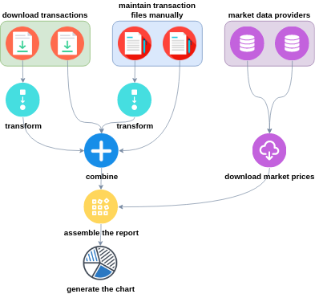

# Remal Portfolio Analyzer

> keywords: java, portfolio, stock market, gdax, interactive broker, etoro, prise, report, currency, exchange rate

## 1) Overview
Investors diversificate investments and build portfolio while investing money on stock market.
Diversification is the practice of spreading your investments around so that your exposure to any one type of asset is limited.
This practice is designed to help reduce the volatility of your portfolio over time.

While you are building your portfolio usually you end up in a situation where you need to manage multiple brokerage accounts parallelly.
For example, you use `Brokerage A` company to trade with cryptocurrencies, then you open another account with `Brokerage B` where you trade on the US market and probably you will open other accounts for the European market.
If you have multiple accounts, then to keep up to date your own portfolio register and build an overall `portfolio summary` report is hard and requires hard manual administration.

<p align="center">
  
</p>

The `Remal Portfolio Analyzer` helps you to track the performance of your separated portfolios in one place with as less effort as possible.
The tool downloads your daily trading transactions from the brokerage companies, merges them into a big ledger, and generates a portfolio summary report based on the live market price as often as you wish.
The report can be any kind of diagram or a [Markdown (text)][markdown] or an Excel file.

## 2) How the tool works
The `Remal Portfolio Analyzer` supports the following activities:
* [Downloading the `trading-history` directly from a brokerage company.](#31-downloading-the-trading-history-data-from-a-brokerage-company)
* [Trading history file transformation, i.e. converting timestamps between time zones, etc.](#32-trading-history-file-transformation)
* Combine multiple `trading history` files into one.
* Showing the `trading history` files.
* Downloading the real time market price based on the provided `ticker/symbol` from market data-provider. 
* Generating the portfolio report.
* Showing the portfolio report on charts (column, line, pie, bar, etc.).
* Calculating a new portfolio report, especially the average price, based on a simulated buy/sell transaction that you are planning to execute. 

The following flow shows how a general workflow looks like:

<p align="center">
  
</p>

## 3) How to execute the tool
The `Remal Portfolio Analyzer` is a command-line tool (`CLI`) that accepts text input from the user to execute the functions.
Today, the majority of applications have a graphical user interfaces (`GUI`), and most users never use command-line interfaces.
However, CLI is still used to configure computers, install software, and access features that are not available in the graphical interface.
The CLI applications provide us with many benefits that are unavailable, difficult to achieve, or incomplete with any GUI applications.
These benefits are numerous, but four in particular may come immediately to mind:
* Scalability
* Scriptability
* Simple design
* Repeatable executions

Considering the benefits of the CLI, this tool is just the right tool for the job.

__The main operations that the `Remal Portfolio Analyzer` supports and the way of recall them is the following:__

* Command to execute: `java -jar portfolio-analyzer.jar`
* Result:
    ```
    Usage: java -jar portfolio-analyzer.jar [-hV] [coinbase | show | combine | price | portfolio]
    Remal Portfolio Analyzer is a command-line tool that helps you to track your portfolio in one place and generate regular investment reports.
    
    -h, --help      Show this help message and exit.
    -V, --version   Print version information and exit.
    
    Commands:
    coinbase   Download your personal transactions from Coinbase.
    show       Show transactions.
    combine    Combine transactions coming from different sources.
    price      Get the price of a stock.
    portfolio  Generates portfolio summary report.
    
    Exit codes:
    0    Successful execution.
    1    An unexpected error appeared while executing this application.
    
    Please report issues at arnold.somogyi@gmail.com.
    Documentation, source code: https://github.com/zappee/portfolio-analyzer
    ```

### 3.1) Downloading the trading-history data from a brokerage company
The tool can download the daily trading transactions from the following brokerage companies:
* Coinbase: Crypto Currency marketplace


* Command to execute: `java -jar portfolio-analyzer.jar coinbase`
  * Result:
    ```
    Usage: java -jar portfolio-analyzer.jar coinbase [-s] (-k=<key> -p=<passphrase> -e=<secret> [-b=<baseCurrency>] [-v=<inventoryValuation>] [-f=<from>]
    [-t=<to>]) [[-O=<outputFile>] [-M=<writeMode>] [-R=<replaces>[,<replaces>...]]... [-E] [-A] [-L=<language>]
    [-C=<columnsToHide>]... [-I=<decimalFormat>] [-D=<dateTimePattern>] [-Z=<zone>] [-F=<from>] [-T=<to>]]
  
    Download your personal transactions from Coinbase.
  
    -s, --silent             Perform actions without displaying any details.
  
    Input (Coinbase PRO API)
    -k, --api-access-key     Coinbase PRO API key.
    -p, --api-passphrase     Coinbase PRO API passphrase.
    -e, --api-secret         Coinbase PRO API secret.
    -b, --base-currency      The currency of your Coinbase account you are allowed to trade, e.g. "EUR", etc. Default: "EUR"
    -v, --valuation          Default inventory valuation type. Candidates: FIFO, LIFO. Default: "FIFO"
    -f, --in-from            Filter on trade date, after a specified date. Pattern: "yyyy-MM-dd HH:mm:ss"
    -t, --in-to              Filter on trade date, before a specified date. Pattern: "yyyy-MM-dd HH:mm:ss"
  
    Output:
    -O, --output-file        Write report to file (i.e. "'tmp/'yyyy-MM-dd'_report.md'"). Accepted extensions: .txt, .md and .csv
    -M, --file-mode          How to write the report to the file. Default: STOP_IF_EXIST Candidates: OVERWRITE, APPEND, STOP_IF_EXIST
    -R, --replace            Replace the portfolio name. Format: "from:to, from:to", e.g. "default:coinbase".
    -E, --hide-title         Hide the report title.
    -A, --hide-header        Hide the table header in the report.
    -L, --language           Two-letter ISO-639-1 language code that controls the report language. Default: EN
    -C, --columns-to-hide    Comma separated list of column names that won't be displayed in the report. Candidates: PORTFOLIO, SYMBOL, TYPE, VALUATION,
    TRADE_DATE, QUANTITY, PRICE, FEE, CURRENCY, ORDER_ID, TRADE_ID, TRANSFER_ID
    -I, --decimal-format     Format numbers and decimals in the report. Default: "###,###,###,###,###,###.########"
    -D, --out-date-pattern   Pattern for formatting date and time in the report. Default: "yyyy-MM-dd HH:mm:ss"
    -Z, --out-timezone       The timezone of the dates, e.g. "GMT+2", "Europe/Budapest" Default: the system default time-zone
    -F, --out-from           Filter on trade date, after a specified date. Pattern: "yyyy-MM-dd HH:mm:ss"
    -T, --out-to             Filter on trade date, before a specified date. Pattern: "yyyy-MM-dd HH:mm:ss"
  
    Please report issues at arnold.somogyi@gmail.com.
    Documentation, source code: https://github.com/zappee/portfolio-analyzer
    ```

The following fields are mandatory and must be provided:

| parameter name         | description                 |
|------------------------|-----------------------------|
| `-k, --api-access-key` | Coinbase PRO API key        |
| `-p, --api-passphrase` | Coinbase PRO API passphrase |
| `-e, --api-secret`     | Coinbase PRO API secret     |

The article ['How to create an API key'][coinbase-api-key] describes the steps to obtain your personal API keys.

The command bellow will download your transaction list from `Coinbase` and show the transactions on the screen:

   ```
   java -jar portfolio-analyzer.jar coinbase \
      -k 94c...a1c \
      -p 9fx...xy7 \
      -e zuT...A==
   ```
_You must replace the API key values with your personal ones before the execution._

You will get a similar output:
   ```
   # Transaction report
   _Generated: 2022-09-18 14:02:05_
  
   |portfolio|symbol |type   |inventory valuation|trade date         |quantity          |price    |fee           |currency|order id     |trade id|transfer id  |
   |---------|-------|-------|-------------------|-------------------|------------------|---------|--------------|--------|-------------|--------|-------------|
   |default  |EUR    |DEPOSIT|                   |2022-01-18 08:51:51|    5 500         |     1   |              |EUR     |             |        |60dea8b3-b796|
   |default  |BTC-EUR|BUY    |                   |2022-02-02 09:15:44|        0.00640035|34 065.92|0.436067622144|EUR     |83bb62a9-c8a5|19094504|             |
   |default  |BTC-EUR|BUY    |                   |2022-02-02 09:15:49|        0.03359965|34 065.92|2.289205977856|EUR     |b0cd4543-0842|19067657|             |
   |default  |BTC-EUR|SELL   |FIFO               |2022-04-12 13:57:33|        0.04      |37 178.52|2.9742816     |EUR     |06e93b40-f824|11160462|             |
   |default  |ETH-EUR|BUY    |                   |2022-06-07 08:17:35|        1         | 1 645.07|3.29014       |EUR     |ca200a35-e23d|11653001|             |
   |default  |BTC-EUR|BUY    |                   |2022-07-05 06:47:25|        0.025     |19 370.35|0.9685175     |EUR     |61787b51-d425|11355386|             |
   |default  |ETH-EUR|BUY    |                   |2022-08-27 10:30:09|        1.5       | 1 515.51|4.54653       |EUR     |f8e65f80-30fc|14563886|             |
   ```

The following commands download and save your transaction history to a Markdown and a CSV file:

* Markdown (text) format:
   ```
  java \
     -jar portfolio-analyzer.jar coinbase \
     -k 94...1c \
     -p 9f...y7 \
     -e zu...== \
     -b EUR \
     -O "'coinbase-transactions_'yyyy-MM-dd'.md'" \
     -M OVERWRITE \
     -E \
     -R default:coinbase \
     -L EN \
     -D "yyyy-MM-dd HH:mm:ss" \
     -Z GMT
   ```
* Excel format:
   ```
  java \
     -jar portfolio-analyzer.jar coinbase \
     -k 94...1c \
     -p 9f...y7 \
     -e zu...== \
     -b EUR \
     -O "'coinbase-transactions_'yyyy-MM-dd'.csv'" \
     -M OVERWRITE \
     -E \
     -R default:coinbase \
     -L EN \
     -D "yyyy-MM-dd HH:mm:ss" \
     -Z GMT
   ```

The `*.csv` file can be opened as an Excel file.
While opening the file use comma (`,`) for the CSV separator character.

For the best user experience open the `*.md` file with a Markdown editor like [dillinger][dillinger], then you will get the following, wel formatted report:

|portfolio|symbol |type   |inventory valuation|trade date         |quantity          |price    |fee           |currency|order id     |trade id|transfer id  |
|---------|-------|-------|-------------------|-------------------|------------------|---------|--------------|--------|-------------|--------|-------------|
|default  |EUR    |DEPOSIT|                   |2022-01-18 08:51:51|    5 500         |     1   |              |EUR     |             |        |60dea8b3-b796|
|default  |BTC-EUR|BUY    |                   |2022-02-02 09:15:44|        0.00640035|34 065.92|0.436067622144|EUR     |83bb62a9-c8a5|19094504|             |
|default  |BTC-EUR|BUY    |                   |2022-02-02 09:15:49|        0.03359965|34 065.92|2.289205977856|EUR     |b0cd4543-0842|19067657|             |
|default  |BTC-EUR|SELL   |FIFO               |2022-04-12 13:57:33|        0.04      |37 178.52|2.9742816     |EUR     |06e93b40-f824|11160462|             |
|default  |ETH-EUR|BUY    |                   |2022-06-07 08:17:35|        1         | 1 645.07|3.29014       |EUR     |ca200a35-e23d|11653001|             |
|default  |BTC-EUR|BUY    |                   |2022-07-05 06:47:25|        0.025     |19 370.35|0.9685175     |EUR     |61787b51-d425|11355386|             |
|default  |ETH-EUR|BUY    |                   |2022-08-27 10:30:09|        1.5       | 1 515.51|4.54653       |EUR     |f8e65f80-30fc|14563886|             |

### 3.2) Trading history file transformation
There is a possibility to convert the data in the transaction file.
You can
* rename the `portfolio name`
* convert the `trade date` between different timezones
* change date-time format of the `trade date`
* change the way how decimal numbers show in `quantity`, `price` and `fee` columns
* hide any columns
* filter the data by `trade-date`


Command: `java -jar portfolio-analyzer.jar show`
Result:
  ```
  Usage: java -jar portfolio-analyzer.jar show [-s] ([-e] [-a] [-p=<portfolio>] [-c=<symbols>]... [-d=<dateTimePattern>] [-z=<zone>] [-f=<from>] [-t=<to>]
  [-m=<missingColumns>]... -i=<file>) [[-O=<outputFile>] [-M=<writeMode>] [-R=<replaces>[,<replaces>...]]... [-E]
  [-A] [-L=<language>] [-C=<columnsToHide>]... [-I=<decimalFormat>] [-D=<dateTimePattern>] [-Z=<zone>] [-F=<from>]
  [-T=<to>]]

  Show transactions.

  -s, --silent             Perform actions without displaying any details.

  Input:
  -i, --input-file         File with transactions. Accepted extensions: .txt, .md and .csv
  -e, --has-title          The report file contains title.
  -a, --has-header         The table has a header in the report.
  -p, --portfolio          Portfolio name filter.
  -c, --symbol             Product filter, that is a comma separated list with symbols, e.g. "BTC-EUR, AMZN".
  -d, --in-date-pattern    Pattern for parsing date and time. Default: "yyyy-MM-dd HH:mm:ss"
  -z, --in-timezone        The timezone of the dates, e.g. "GMT+2", "Europe/Budapest" Default: the system default time-zone
  -f, --in-from            Filter on trade date, after a specified date. Pattern: "yyyy-MM-dd HH:mm:ss"
  -t, --in-to              Filter on trade date, before a specified date. Pattern: "yyyy-MM-dd HH:mm:ss"
  -m, --missing-columns    Comma separated list to set the missing columns in the report. Use with the '-columns-to-hide' option.

  Output:
  -O, --output-file        Write report to file (i.e. "'tmp/'yyyy-MM-dd'_report.md'"). Accepted extensions: .txt, .md and .csv
  -M, --file-mode          How to write the report to the file. Default: STOP_IF_EXIST Candidates: OVERWRITE, APPEND, STOP_IF_EXIST
  -R, --replace            Replace the portfolio name. Format: "from:to, from:to", e.g. "default:coinbase".
  -E, --hide-title         Hide the report title.
  -A, --hide-header        Hide the table header in the report.
  -L, --language           Two-letter ISO-639-1 language code that controls the report language. Default: EN
  -C, --columns-to-hide    Comma separated list of column names that won't be displayed in the report. Candidates: PORTFOLIO, SYMBOL, TYPE, VALUATION,
                           TRADE_DATE, QUANTITY, PRICE, FEE, CURRENCY, ORDER_ID, TRADE_ID, TRANSFER_ID
  -I, --decimal-format     Format numbers and decimals in the report. Default: "###,###,###,###,###,###.########"
  -D, --out-date-pattern   Pattern for formatting date and time in the report. Default: "yyyy-MM-dd HH:mm:ss"
  -Z, --out-timezone       The timezone of the dates, e.g. "GMT+2", "Europe/Budapest" Default: the system default time-zone
  -F, --out-from           Filter on trade date, after a specified date. Pattern: "yyyy-MM-dd HH:mm:ss"
  -T, --out-to             Filter on trade date, before a specified date. Pattern: "yyyy-MM-dd HH:mm:ss"

  Please report issues at arnold.somogyi@gmail.com.
  Documentation, source code: https://github.com/zappee/portfolio-analyzer
  ```

## 4) Generating the portfolio summary diagram

## 5) Installation and system requirements

[markdown]: https://www.markdownguide.org/basic-syntax "Markdown"
[coinbase-api-key]: https://help.coinbase.com/en/exchange/managing-my-account/how-to-create-an-api-key
[dillinger]: https://dillinger.io

<a href="https://trackgit.com"></a>
